<div align="center">

# 🧠 AI-Based Emotion Detection Web API

A Python Flask web application that dynamically detects emotions in text using IBM Watson Natural Language Understanding (NLU).

[](https://www.python.org/)
[](#)
[](#)
[](#)
[](#)
<br>
[](https://www.coursera.org/professional-certificates/ibm-full-stack-cloud-developer)
[](#)

</div>

---

## 📌 Project Overview

This repository contains the full code for an AI-powered backend API, including unit tests and deployment setups. By integrating **IBM Watson Natural Language Understanding (NLU)** into a **Flask** web server, this application processes raw text inputs to detect a spectrum of human emotions and mathematically determine the dominant emotional tone.

---

## 🏗️ Architecture Flow Diagram

```mermaid
graph LR
    Client(["👤 Client (Web / Postman)"])
    Flask["🐍 Flask Server (server.py)"]
    Logic["⚙️ Emotion Logic (emotion_detection.py)"]
    Watson["🧠 IBM Watson NLU API"]

    Client -->|"1. HTTP Request with text"| Flask
    Flask -->|"2. Passes text string"| Logic
    Logic -->|"3. NLP API Request"| Watson
    Watson -->|"4. JSON Emotion Scores"| Logic
    Logic -->|"5. Extracts Dominant Emotion"| Flask
    Flask -->|"6. HTTP 200 JSON Response"| Client

    style Client fill:#e1f5fe,stroke:#0288d1,stroke-width:2px,color:#000
    style Flask fill:#e8f5e9,stroke:#388e3c,stroke-width:2px,color:#000
    style Logic fill:#f3e5f5,stroke:#8e24aa,stroke-width:2px,color:#000
    style Watson fill:#fff3e0,stroke:#f57c00,stroke-width:2px,color:#000
```




## 🚀 Key Features

* **Comprehensive Emotion Analysis:** Detects and scores multiple emotions (anger, disgust, fear, joy, sadness) from any given text.
* **Dominant Emotion Identification:** Automatically parses the scores to highlight the primary emotional tone.
* **RESTful API Architecture:** Clean, simple API endpoints designed for seamless frontend integration.
* **Robust Error Handling:** Gracefully catches and manages invalid inputs or empty queries.
* **High Code Quality:** Fully verified and compliant with a **10/10 PyLint** score.
* **Deployment Ready:** Easily deployable via local Flask servers or containerizable using Docker for cloud hosting.

---

## 🛠️ Core Tech Stack

| Category | Technologies Used | Purpose |
| :--- | :--- | :--- |
| **Backend Framework**| Python, Flask | Server logic, API routing, and HTTP request handling |
| **Artificial Intelligence**| IBM Watson NLU | NLP model for emotion parsing and sentiment analysis |
| **Code Quality** | PyLint | Ensuring clean, standardized, and error-free code |
| **Deployment Environments** | Local Server, Docker | Infrastructure for running and hosting the application |

---

## 📁 Project Structure

```text
final_project/
├── EmotionDetection/
│   └── emotion_detection.py  # Core emotion detection logic using Watson NLP
├── server.py                 # Flask API server routing
├── requirements.txt          # Python dependencies
└── README.md                 # Project documentation
```

⚙️ Installation & Execution
To run the application locally on your machine, follow these steps:
1. Create a Virtual Environment
Isolating the project dependencies is highly recommended.
```text
python -m venv venv
```
2. Activate the Environment
# On Linux / macOS:
```text
source venv/bin/activate
```

# On Windows:
```text
venv\Scripts\activate
```

3. Install Dependencies
```text
pip install -r requirements.txt
```

4. Run the Server
```text
python server.py
```

The Flask server will initialize and begin listening for API requests.

## 📡 API Response Example
Once the server is running, submitting a valid text query to the endpoint will return a formatted JSON response mapping the emotional scores:
```text
{
  "response": "For the given statement, the system response is 'anger': 0.0, 'disgust': 0.0, 'fear': 0.0, 'joy': 0.95, 'sadness': 0.05. The dominant emotion is joy.",
  "emotions": {
    "anger": 0.0,
    "disgust": 0.0,
    "fear": 0.0,
    "joy": 0.95,
    "sadness": 0.05,
    "dominant_emotion": "joy"
  }
}
```

## 👤 Author

**Hamed Payanda**
* **GitHub:** [@HAMED-PAYANDA](https://github.com/HAMED-PAYANDA)
* Completed as part of the **IBM Full-Stack Software Developer Professional**.


